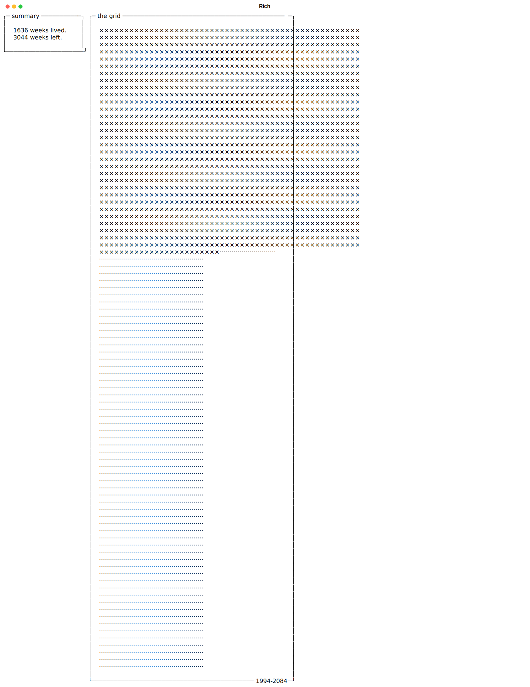

# The Grid

A simple single-file script that generates a grid that represents your lifetime based on your birthday and expected lifespan.



> Keep in mind that each row aligns to the provided birthday, not on January 1.

## Usage

1. Install [`uv`](https://docs.astral.sh/uv/):

```bash
# macOS/Linux
curl -LsSf https://astral.sh/uv/install.sh | sh

# Windows (Powershell)
powershell -ExecutionPolicy ByPass -c "irm https://astral.sh/uv/install.ps1 | iex"
```

2. Download the script using:

```bash
# curl
curl -L -o thegrid.py https://raw.githubusercontent.com/dnlzrgz/thegrid/refs/heads/master/thegrid.py

# wget
wget -O thegrid.py https://raw.githubusercontent.com/dnlzrgz/thegrid/refs/heads/master/thegrid.py
```

3. Run:

```bash
uv run thegrid.py --birthday 1991-02-20
```

4. To see all the available options:

```bash
uv run thegrid.py --help
```

## Motivation

I was watching a video about "the grid" ([Le temps qu'il vous reste (à vivre) - DBY #88](https://www.youtube.com/watch?v=q_AL1ROAJ6c)) and I liked the concept, so I decided that it would be fun to build a small CLI that generates said grid.

## Why a single file script?

I originally wanted to publish this project on [`pypi`](https://pypi.org), but a naming conflict blocked the publication, so I decided to convert it into a single-file script to avoid the hassle.
